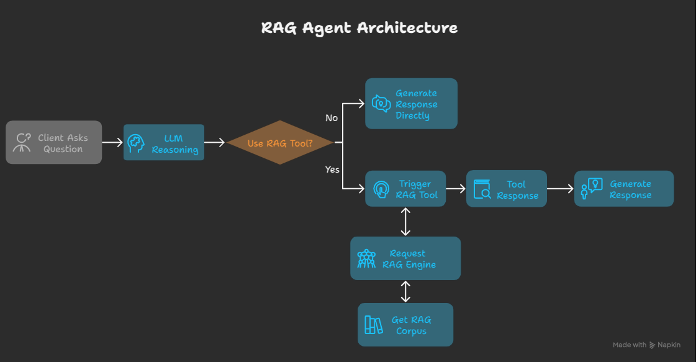

[](https://mseep.ai/app/khoi03-adk-mcp-rag)

# RAG Agent with Google ADK and Qdrant MCP server

A Retrieval-Augmented Generation (RAG) system that leverages Google's Agent Development Kit (ADK) and Qdrant vector database via MCP server.

## Table of Contents
- [Overview](#overview)
- [Architecture](#architecture)
- [Features](#features)
- [Prerequisites](#prerequisites)
- [Installation](#installation)
- [Configuration](#configuration)
- [Usage](#usage)

## Overview

This project implements a Retrieval-Augmented Generation (RAG) system that combines the power of Google's Agent Development Kit (ADK) with Qdrant vector database (via MCP server) for efficient knowledge retrieval. The system enhances Large Language Model (LLM) responses by retrieving relevant context from a vector database before generating answers.

## Architecture


## Features

- **Advanced Retrieval**: Semantic search powered by Qdrant vector database
- **Google ADK Integration**: Leverages Google's Agent Development Kit for LLM capabilities
- **MCP Server**: Model Context Protocol server for Qdrant vector database
- **Context Augmentation**: Enhances LLM responses with relevant retrieved information
- **Monitoring & Logging**: Comprehensive tracking of system performance

## What changed for the Recipe Bot (my modifications)

This fork adapts the base RAG template into a recipe-focused assistant, adds a unit-conversion sub-agent, and wires in Quarto-sourced recipe data.

### 1) Unit Conversion Sub‑Agent

- New sub-agent: `agents/sub_agents/unit_conversion/`
	- `agent.py` creates a lightweight `google.adk.Agent` named `unit_conversion_agent` using model `gemini-2.0-flash`.
	- `prompt.py` defines `UNIT_CONVERSION_PROMPT` with detailed, kitchen-appropriate conversions (cups/tbsp/tsp/oz, ranges, qualifiers, edge cases).
	- `__init__.py` exports `unit_conversion_agent`.
- Integration into the root agent: `agents/agent.py`
	- The main RAG agent is created via `google.adk.agents.llm_agent.LlmAgent` and now includes the sub-agent as a tool using `google.adk.tools.agent_tool.AgentTool`:
		- `tools=[toolset, AgentTool(agent=unit_conversion_agent)]`
	- This allows the root agent to delegate measurement conversions to the dedicated sub-agent when needed.

### 2) Recipe‑Focused System Prompt

- Prompt config: `agents/config/prompts.yml`
	- The `ask_rag_agent.instruction_prompt` is rewritten to make the assistant an expert culinary assistant trained on a recipe corpus.
	- It instructs the agent to use the retrieval tool for cooking/baking questions, provide clear answers with citations, and to use the `unit_conversion` tool for measurement conversions.
- Prompt loading: `agents/tools/prompts.py`
	- `PromptLoader` reads `agents/config/prompts.yml`; `agents/agent.py` uses this to set the root agent’s `instruction`.

### 3) Quarto → Data → Vector Store Workflow

- Quarto project lives under `quarto/` with recipes in `quarto/recipes/*.qmd`.
- Render and export PDFs with embedded metadata, then copy into `data/`:
	- Script: `src/01-render_recipes_and_copy_pdf.py`
		- Renders the Quarto site to HTML (`quarto/_site`).
		- Creates augmented temporary `.qmd` files that include the YAML front matter as a visible code block so metadata is preserved in PDF text.
		- Renders per-file PDFs into `quarto/_pdf/**` and copies them to `data/**` (preserving folder structure).
- Ingestion into the local vector store:
	- Script: `local_vector_store/prepare_corpus_and_data_locally.py`
		- Loads `data/*/*.md` and all PDFs in `data/` using LangChain loaders.
		- Splits into chunks (size 800, overlap 400) and assigns stable chunk IDs (`<source>:<page>:<idx>`).
		- Inserts only new chunks into Qdrant to avoid duplicates.
	- Vector DB helper: `local_vector_store/vector_db.py`
		- Wraps a `QdrantClient` configured with both dense (`sentence-transformers/all-MiniLM-L6-v2`) and sparse (`Qdrant/bm25`) models.
		- Uses simplified `client.add()` for embedding + upsert and `client.query()` for retrieval.

### End‑to‑End flow (quick start)

1) Render Quarto content and copy PDFs into `data/`:

	 ```powershell
	 python .\src\01-render_recipes_and_copy_pdf.py
	 ```


2) Ensure Qdrant MCP is up (see “Build Qdrant and Qdrant MCP” below).

3) Ingest data into the vector store:

	 ```powershell
	 python .\local_vector_store\prepare_corpus_and_data_locally.py
	 ```

4) Run the agent:

	 ```powershell
	 python .\main.py
	 ```

Notes:
- The root agent will cite recipe titles when answers use retrieved content.
- When users ask for measurement conversions, the root agent will route to the unit‑conversion sub‑agent.
- The MCP SSE endpoint is read from the `QRANT_MCP_SSE` environment variable (see `agents/agent.py`).

## Installation

Remember to install the [uv](https://docs.astral.sh/uv/getting-started/installation/) first
```bash
# Clone the repository
git clone https://github.com/khoi03/adk-mcp-rag.git
cd adk-mcp-rag

# Create a virtual environment and install dependencies
uv sync

# Activate the virtual environment
# For macOS/Linux
source .venv/bin/activate
# For Windows
.venv\Scripts\activate

# Add required dependencies via requirement file (In case there are new libs)
uv add -r requirements.txt
```

## Configuration

### Environment Variables

Create a `.env` file in `docker` directory:

```bash
# Change directory into docker
cd docker

# Set up environment variables
cp .env.example .env
# Edit .env with your API keys and configuration
```

Example `.env` file:
```bash
# -------------------
# Google API keys
# -------------------
GOOGLE_API_KEY=YOUR_VALUE_HERE

# -------------------
# OPENAI API keys
# -------------------
OPENAI_API_KEY=YOUR_VALUE_HERE

# -------------------
# ANTHROPIC API keys
# -------------------
ANTHROPIC_API_KEY=YOUR_VALUE_HERE

# -------------------
# Network names
# -------------------
NETWORK_NAME=mcp-servers

# ----------------------------------
# Parameters for Qdrant MCP Server 
# ----------------------------------
QDRANT_CONTAINER_NAME=qdrant-mcp
QDRANT_URL=http://qdrant:6333
QRANT_MCP_SSE=http://localhost:8888/sse
# QDRANT_LOCAL_PATH=/qdrant/db
COLLECTION_NAME=default_collection
QDRANT_EMBEDDING_MODEL=sentence-transformers/all-MiniLM-L6-v2
QDRANT_SEARCH_LIMIT=3
FASTMCP_HOST=0.0.0.0
FASTMCP_PORT=8888
```

### Build Qdrant and Qdrant MCP
Build Qdrant and Qdrant MCP server using Docker Compose after completing the configuration steps:

```bash
# Build and start services
docker compose -p qdrant-mcp up --build -d

# Check running services
docker compose ps

# View logs
docker compose logs -f

# Stop and remove services
docker compose -p qdrant-mcp down
```

You can also access qdrant web UI at `http://localhost:6333/dashboard`

## Usage

### Document Ingestion
Push all your needed files into the `data` directory and run:

```bash
python local_vector_store/prepare_corpus_and_data_locally.py
```
Note: Currently only processes .md and .pdf files. The system will:

1. Extract text from the documents
2. Split the text into manageable chunks
3. Generate embeddings for each chunk
4. Store the embeddings in the Qdrant vector database

### Basic Usage
To test and run the system with default settings:

```bash
python main.py
```

### Built-in ADK-UI
For tracing, testing, and debugging with a UI, run the built-in web interface provided by ADK:

```bash
adk web
```

## Project Structure

```bash
adk-mcp-rag/
├── assets/                  # Images and static files
├── data/                    # Documents for ingestion
├── docker/                  # Docker configurations
│   ├── .env.example         # Example environment variables
│   ├── Dockerfile.qdrant    # Docker file for qdrant mcp
│   └── docker-compose.yml   # Docker Compose configuration
├── agents/                  # Main code
│   ├── config/prompts.yml   # Store prompts
│   ├── tools/               # Embedding generation
│       ├── mcp_tools.py     # Manage MCP Tools
│       └── prompts.py       # Manage Prompts
│   └── agent/               # Manage agents
├── .gitignore               # Git ignore file
├── main.py                  # Main entry point
├── README.md                # This file
└── requirements.txt         # Python dependencies
```

## Modifications

I have added the following files and directories to the original ADK repo:
- agents/eval

which contains 

python -m pytest -s -vv `test_eval.py` 

